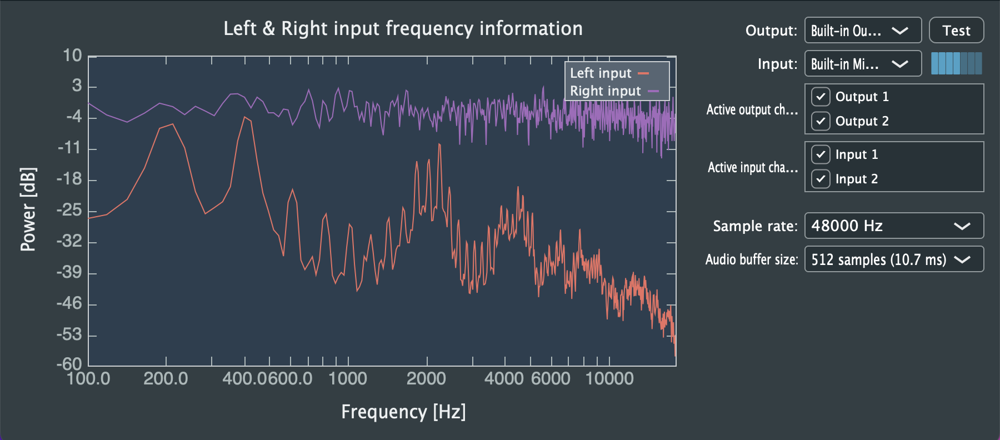

# Realtime frequency plot example app

This is an example app for the CustomMatPlot Library. It plots the frequency response of the incoming microphone signal or the chosen input in the device manager. The app is based on the SimpleFFT example from JUCE.



## Requirements
<a name="requirements"></a>

- Compiler that supports C++17
- CMake 3.12

## Build
```sh
# Clone respiratory
git clone https://gitlab.com/frans.rosencrantz/realtime-frequency-plot-example.git

# Update submodules
git submodule update --init

cd realtime-frequency-plot-example
mkdir build
cd build

# Configure
cmake ../

# Build
make -j4
```

## License
<a name="license"></a>

The MIT License (MIT)

Copyright (c) 2017-2022 Frans Rosencrantz

**Free Software, Hell Yeah!**